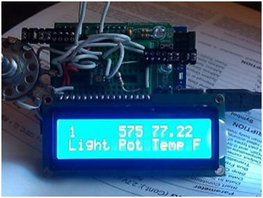
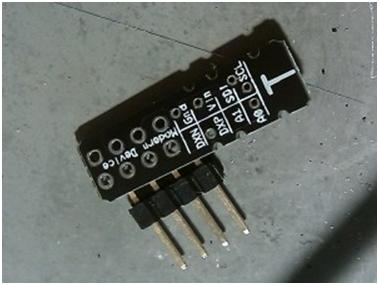
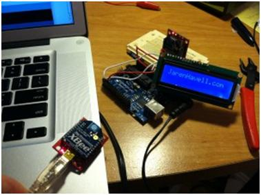

# Server Room Environmental Monitoring -Light and Temperature

*April 27, 2011*

Server Room Environmental Monitoring -Light and Temperature

**April 27, 2011 by Jaren**

**Update: Featured on Hackaday!**

Did I leave the light on in the server room again? Kind of like “did I leave the oven on” question… it’s going to bug me all night!

At least I am well on my way to answering that, and several other questions I might be wondering.

My goal with this project is to set up a remote monitoring device I can place in my server room that will display basic information such as temperature, ambient light values, decibels, current draw, etc.

Right now I have a 16×2 character (parallel)LCD from JKdevices. Its compatible with the Hitachi HD44780, so it works great with the Arduino LiquidCrystal library.

I have it connected in 4bit mode.

***Arduino with potentiometer, temperature and light sensors***

I have the Arduino reading the 3 sensors and storing them to variables. The light and potentiometer values are stored to an integer, and the temperature is stored in a float. Those variables are then “printed” to the LCD screen, every 500 milliseconds.

Here is the temperature sensor  

***Modern Devices I2C Temp Sensor***

The sensor is based around TI’s TMP421. I purchased this board from Liquidware. The breakout board is manufactured by Modern Devices.  It’s accurate to within +/- 1 degree Celsius, or for us Americans, +/- 1.8 degrees Fahrenheit. It’s based off the I2C protocol, and includes a library to  make things (somewhat) easier to use.

The light sensor is manufactured by Vishay, The TEMT6000 [datasheet] from Sparkfun Electronics .

Right now I have no idea what units it is reading, just that the value changes proportionally to the amount of light.

The final item on the display is updating the value from a potentiometer. Not much use for that unless I need a position sensor for something that rotates or opens.

I’m ordering a few more sensors – more to come as parts come in!

—————-

LCD Pinout

Blue Backlit LCD

Standard HD44780 Interface

Runs on 5 volts

16×2 Character Display

4 Mounting Holes

|  |  |  |
| --- | --- | --- |
| Pin | Symbol | description |
| 1 | GND | Ground |
| 2 | Vcc | Vcc (+5V) also powers backlight |
| 3 | V0 | Contrast adjustment |
| 4 | RS | Register select: low = instruction, high = data |
| 5 | R/W | low = write, high = read |
| 6 | E | Enable (active high) |
| 7 | DB0 | Data-bus bit 0 (not used in 4-bit mode) |
| 8 | DB1 | Data-bus bit 1 (not used in 4-bit mode) |
| 9 | DB2 | Data-bus bit 2 (not used in 4-bit mode) |
| 10 | DB3 | Data-bus bit 3 (not used in 4-bit mode) |
| 11 | DB4 | Data-bus bit 4 |
| 12 | DB5 | Data-bus bit 5 |
| 13 | DB6 | Data-bus bit 6 |
| 14 | DB7 | Data-bus bit 7 |
| 15 | LED+ | Positive backlight supply (if used) |
| 16 | LED- | Negative backlight supply (if used) |

————–

Update 5/13/2011

PIR sensor and Audio level sensor have arrived, along with ethernet shield. Trying to get something solid together over the weekend, before next week’s Maker Faire in SF.

————-

Update 6/14/2011

Received new parts – sparkfun i2C  backpack for LCD.

Ran into a snag with my Arduino duemilanove -I think I blew up burned out the FTDI chip! Not to worry, I hooked up the Xbee for easy “wireless” programming! Got the backpack soldered to the LCD and got it displaying temperatures. Biggest issue was finding the right code to talk to an i2c display, then pushing over the temperature data. The temperature from the sensor is stored as a Float. Floats will not transfer over the serLCD from Sparkfun, so I needed to change it to an integer first. Who knew?

Part 2
