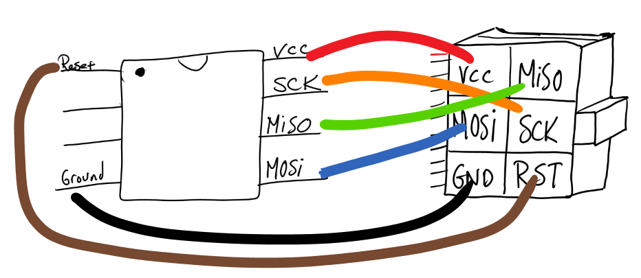
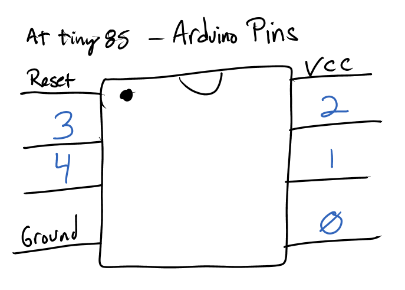
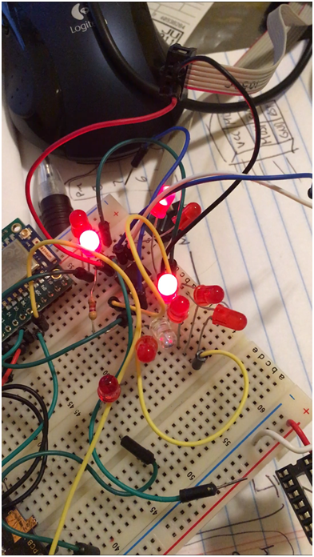
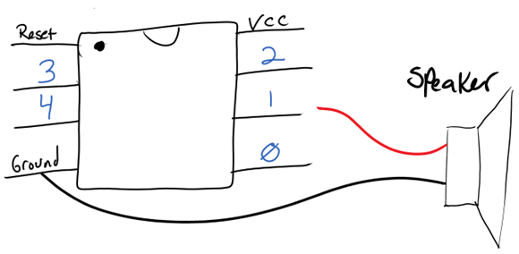
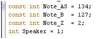
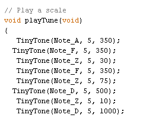
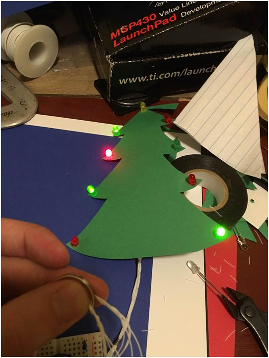
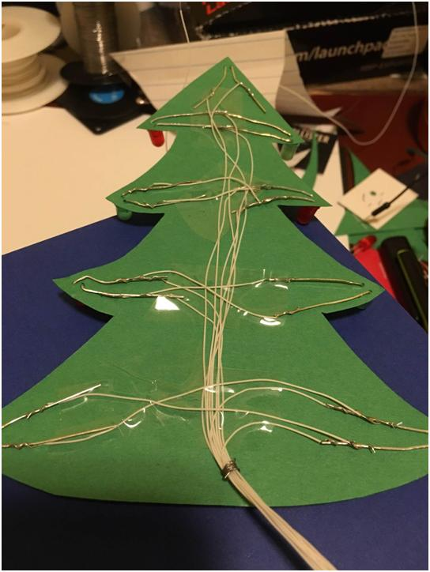
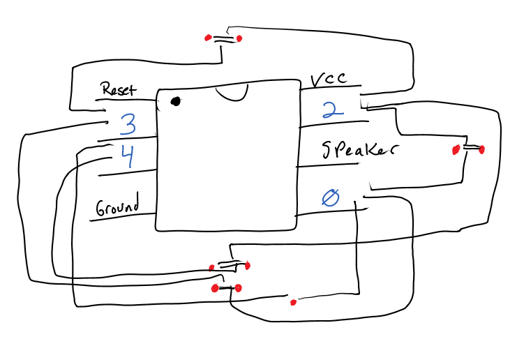
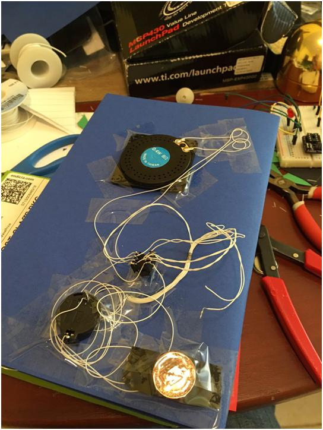

# Light up musical Christmas Card

*December 29, 2015*

Originally Posted on Tuesday, December 29, 2015

Three days before Christmas, just as I was falling asleep, I had a vision of a led Christmas tree card.  I imagined it would have a number of charliplexed LED’s blinking in a decorative fashion. I had a few AT Tiny85 microcontrollers on hand from prior projects on hand, and the mice were all asleep, so I decided to give it a go.

First off came the experimentation with the Charliplex circuit. A quick google search revealed some interesting sample code specifically written for the ’85. Also required is a quick reference of the pinout diagrams for and the 6 pin ISP programming connector and the ISP pins on the ATtiny.

Parts List:

- Red and Green 5mm LEDs
- ATiny85
- Jumpers
- Breadboard
- [USBTinyISP](https://learn.adafruit.com/usbtinyisp/drivers) programmer
- Small flat speaker

Reference Code used:

- [Simple Tones for Attiny](http://www.technoblogy.com/show?KVO)
- [Charliplex code for ATtiny85](http://forum.arduino.cc/index.php?topic=135596.0)

Once the ISP Pins were plugged into the micro with jumpers, It was time to program the ATTiny.

Step 1 – Upload Bootloader

Step 2 – Upload simple “Blink” Program

Step 3 – use sample Charliplex code with leds

A few quick jumpers on a breadboard yielded some blinkenlights.

First, we try out the sample Charliplex Code

Video   
 

[Video: https://www.youtube.com/watch?v=g_e-rlb_T60]

Next, we locate some code that can play back simple tones using a single pin of the ATtiny.

Connecting the speaker is simple

Video: a simple Chromatic scale

[Video: https://www.youtube.com/watch?v=LuzdY4FY4PM]

Next was determining what notes sounded like Christmas Time Is Here from Charlie Brown Christmas.

I played around with a keyboard to find simple tones (not chords) that sound similar to this tune.

To my untuned, musically challenged ear, the beginning sounds somewhat like A, F , F, D, D.

To get the timing right, I added a new “note” called Z which results in an inaudible frequency when played, as a delay.

I included note “Z” to add delays between notes.

The final result sounds like this:

Video: Christmas Time Is Here

[Video: https://www.youtube.com/watch?v=7KD_jHFhr6M]

Because code generated using the Arduino IDE’s main loop is single threaded, you can only play music OR flash LEDs using the above code, not both at the same time. Because this was 2 days before Christmas, I simply did not have enough time to figure out how to do it the right way. I opted for the “hacky” solution, simply alternating between led lights and tunes. Alternatively, I did experiment with two chips, one playing the tunes and one flashing the lights, as seen in the following video.

Video: two AtTiny 85 chips  
  

[Video: https://www.youtube.com/watch?v=dfhfa9hy4lk]

Next, I assembled the basic card structure ( a Christmas Tree with LEDs) and wired up 4 pairs of LEDs, arranged with the reverse polarity of its sibling.

The hookup is roughly as follows for each pair, plus one single LED.

And the messy wiring

I added a simple momentary push button switch to connect the 3v lithium cell to power the circuit. I taped a penny behind it for rigidity.

Finished product – video

[Video: https://www.youtube.com/watch?v=4oS14ixePlU]

Merry Christmas!
