# Remote assistance msra.exe

*April 26, 2016*

This post was republished to JarenHavell.com at 11:43:10 AM 4/5/2016

**One lazy trick the IT guy uses to fix your computer**

Catchy internet marketing titles aside, this article shows you how to use msra.exe to remotely connect to computers that you control.

Tired of walking through the snow and rain to help with simple helpdesk requests?

Behold the power of Remote Assistance, built right into windows! This feature can be implemented for your environment, assuming that you are using Active Directory and Group Policy with your windows 7/8 environment. This allows you (or your minions) to remotely offer assistance to a user, initiating an “unsolicited” interactive remote desktop connection, with the option for you to request control of their machine. This does not, however, allow you to force remote control of the user’s computer. (There used to be a trick for Windows XP, but it does not work with windows 7/8)

**Step 1** – (for you, the helper)

|  |  |
| --- | --- |
| Create a shortcut to | C:\Windows\System32\msra.exe /offerra |

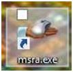

**Step 2** – (on your Domain)

Create a group that will be allowed to initiate connections.

Example “Offer Remote Assistance Helpers”

Add users to the group who will have permission to remotely assist others.

**Step 3** – create a new GPO in an OU containing computers, called “Remote Assistance Policy”

Edit the GPO for Computer Configuration.

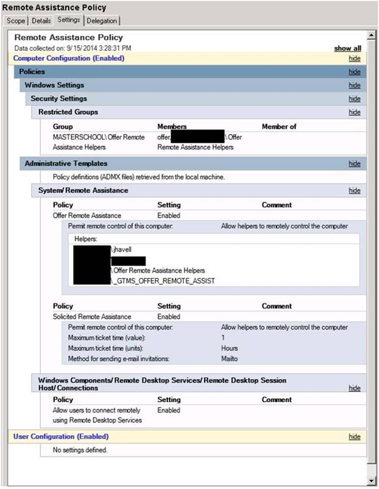

**Step 3.1**

Computer Configuration > Policies > Windows Settings > Security Settings > Restricted Groups

Right click/ Add Group

Browse for the Active directory group you created above.

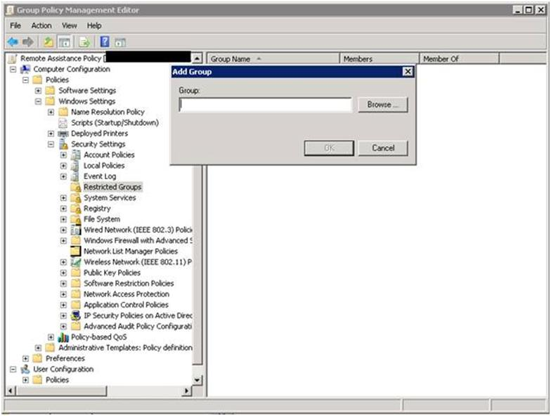

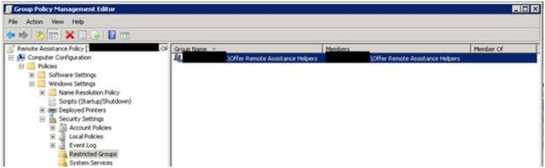

**Step 3.2**

Go to Computer Configuration > Administrative Templates > System > Remote Assistance and click Configure **Offer Remote Assistance**.

- **Enable** the policy

  - Permit remote control of this computer using “**Allow Helpers to remotely control the computer**”
  - click **Show…** next to Helpers
  - Enter the names in **domain\user** or **domain\group** format.
  - Enter the group name you created earlier

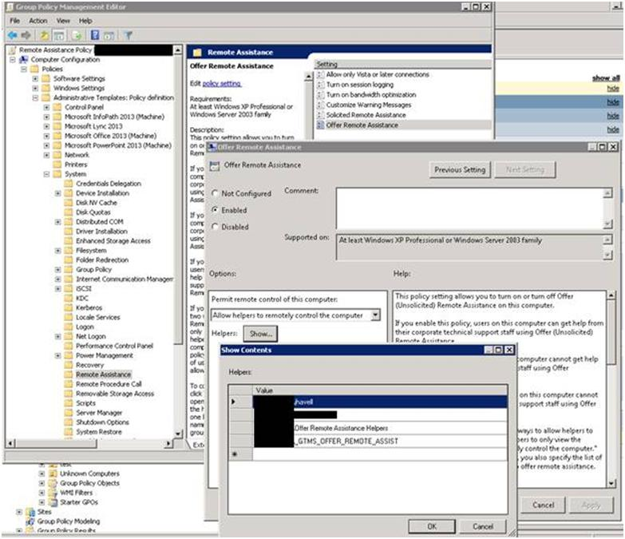

Or in 2012 R2

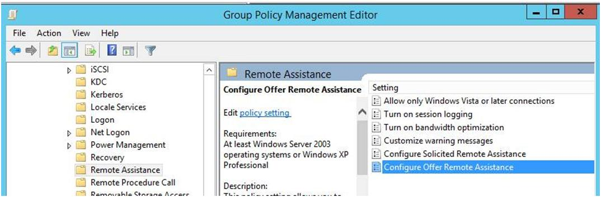

**Step 3.3**

In the same settings folder, enable **Solicited Remote Assistance**

This setting may also be found under

Computer Configuration > Administrative Templates > System > Remote Assistance and click **Solicited Remote Assistance**.

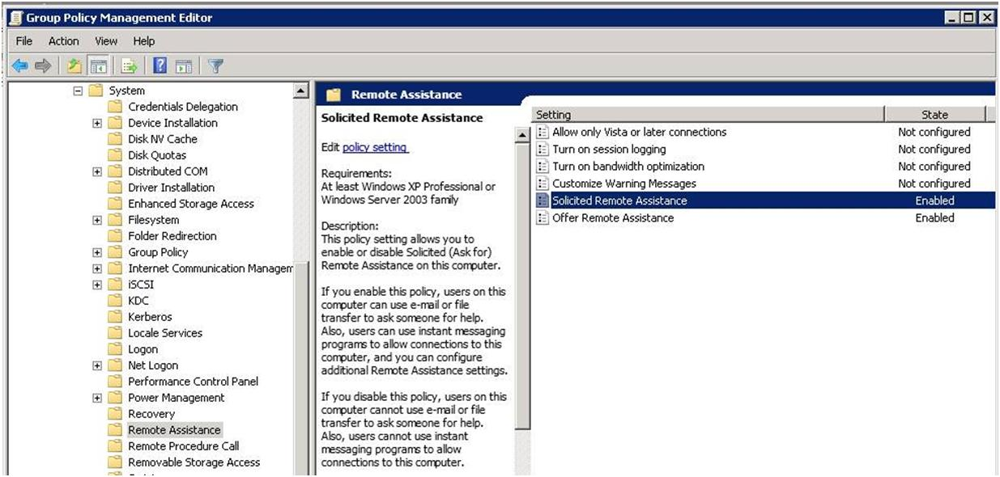

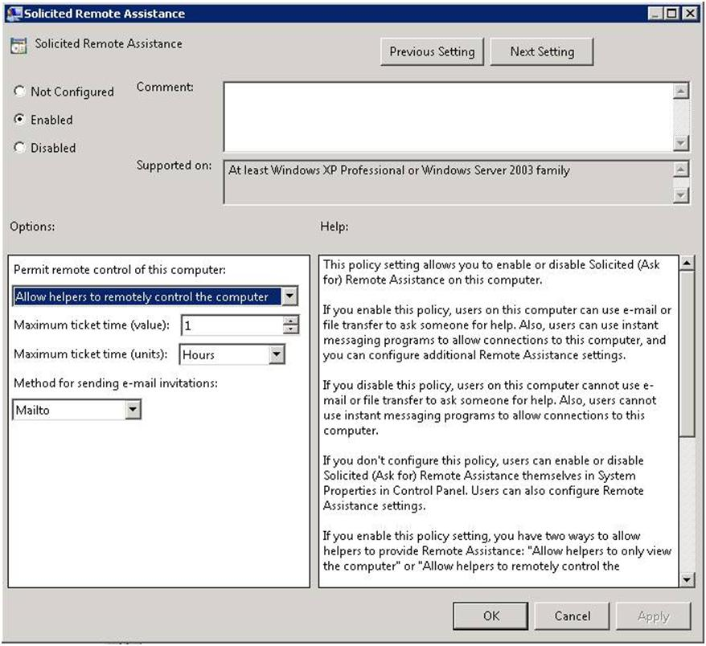

**Step 3.4**

Go to Computer Configuration >Administrative Templates> Windows Components >Remote Desktop Services>Remote Desktop Session Host>Connections

Enable “**Allow users to connect remotely using Remote Desktop Service**s”

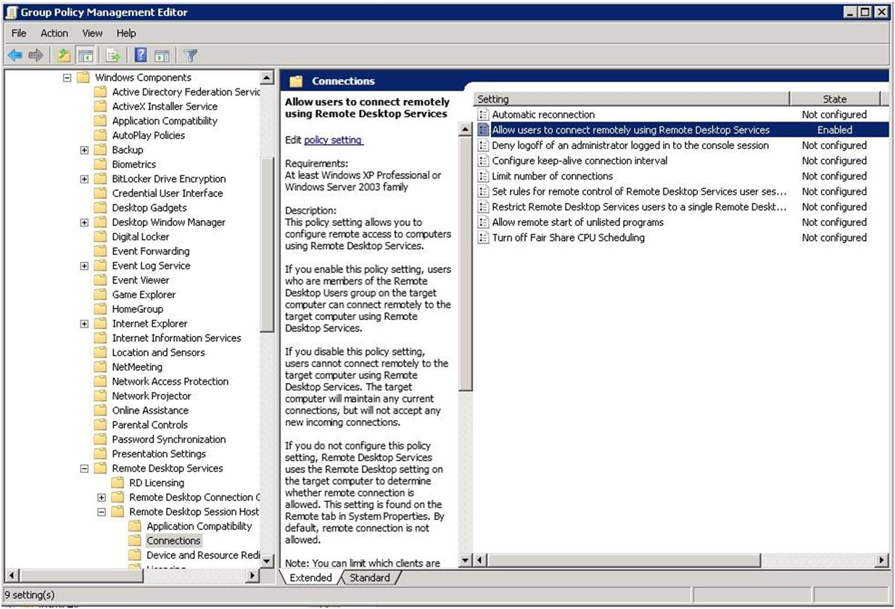

**Step 4**  Apply this GPO to target computers. This can be done at the root of the domain, or under each OU, depending on desired deployment strategy and security considerations.

**Step 5** – perform a Gpupdate on server and clients and test to see if the settings work.

**Step 6 –**  When a user asks for help, launce the msra from the icon using the shortcut.

(C:\Windows\System32 msra.exe /offerra)

**Testing**:

On your PC, launch the new icon

Enter the **Computer Name** and click next

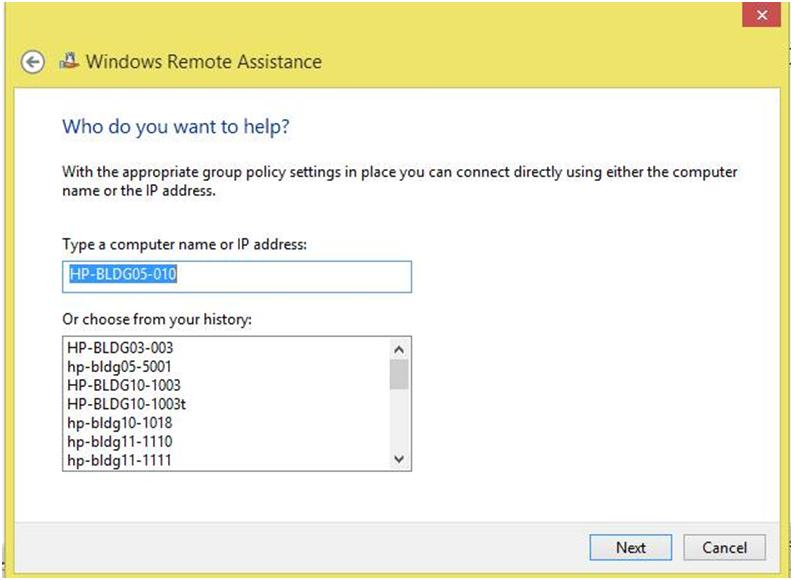

The user will be prompted with the following:

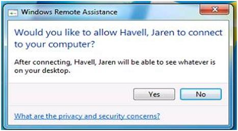

Once the user clicks Yes, you will see the following.

Notice their desktop image has gone black. This is to preserve network bandwidth for smooth operation. The background will be restored once the support session ends.

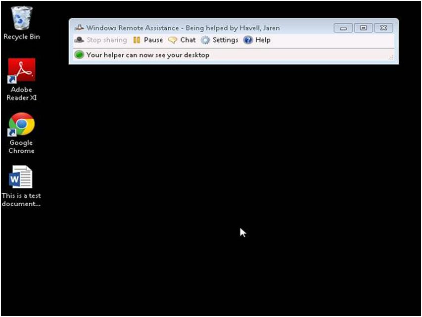

You can select the “Request Control” screen

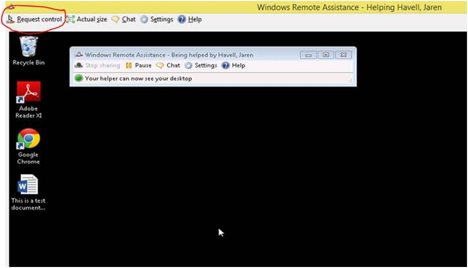

Which prompts the user for permission once again.

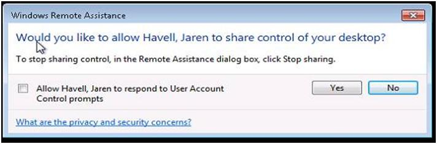

 (Do not bother with the checkbox for UAC, unless the user you are helping is a local administrator on their PC. If they do not have local admin rights, they will get a popup asking for credentials, and you will get a black screen with an X, causing confusion for both of you.)

Once you are done, you or the user may close the Windows Remote Assistance box to end the session!
