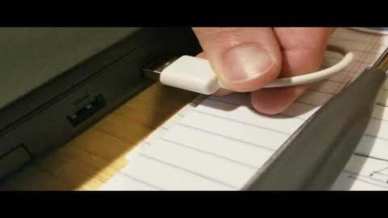
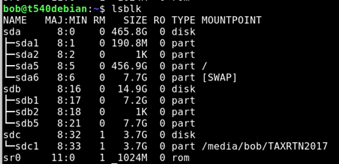
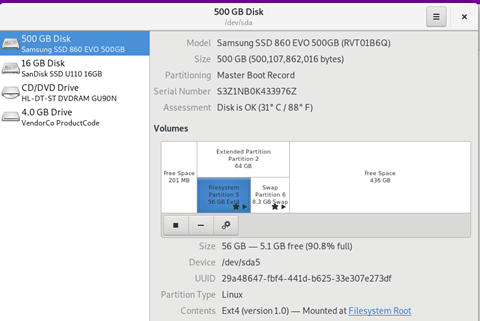
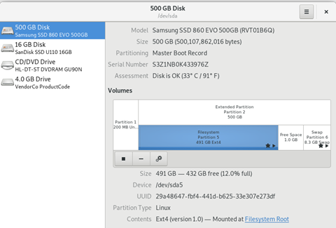

# Cloning a Debian system

*December 26, 2018*

Any computer system can be “cloned” using a variety of methods. Clonezilla is my preferred method.

This post is the companion notes to my video [Clone / upgrade a Debian system with Clonezilla and Gparted](https://www.youtube.com/watch?v=4fYu8lAG_Ng)

When using [Clonezilla](http://www.clonezilla.org), we ideally clone from a small drive to a large drive, performing a disk to disk copy of all data and partitions, then extend our desired partition using an offline partition tool such as [Gparted](https://gparted.org/). In this particular instance, I will be cloning the small 64GB drive in my thinkpad to a much larger 500GB drive. (It is possible to clone from a larger disk to a smaller disk assuming that there is enough free space, but that will be covered elsewhere)

You will need some way to connect both drives at once. I recommend a [USB based SATA adapter](https://smile.amazon.com/StarTech-com-SATA-Drive-Adapter-Cable/dp/B00XLAZODE/ref=sr_1_2_sspa?ie=UTF8&qid=1545876609&sr=8-2-spons&keywords=usb%2Bsata%2Badapter&th=1), or similar [USB to (m key) nvme](https://smile.amazon.com/QNINE-Adapter-Performance-Portable-Support/dp/B07JKWHFRC/ref=sr_1_1_sspa?ie=UTF8&qid=1545876725&sr=8-1-spons&keywords=nvme+usb&psc=1) or [USB to MSata](https://smile.amazon.com/s/ref=nb_sb_noss_1?url=search-alias%3Daps&field-keywords=usb+msata&rh=i%3Aaps%2Ck%3Ausb+msata).

It is also possible to clone to an image file first (Disk to image), and then restore the image to your destination disk, but that takes longer and can be avoided if you can get the right adapters.

Rather than download two separate tools and make multiple boot disk tools, I will be using he [DRBL](https://drbl.org/) (Diskless Remote Boot in Linux), which loads up as a live linux disk with clonezilla and gparted preloaded. It’s a beautiful thing.

The process is fairly straightforward. Connect the bigger drive by USB, shut down and Boot up clonezilla live, perform the disk to disk copy, then swap in the new drive to verify things are peachy. After that, we need to extend the partition, and since we cant adjust the systems storage while mounted, we boot up and launch gparted. In order to extend a partition, we need it to be located right next to the free space. It may be necessary to move the partitions around so that the partition we want to extend is adjacent to the free storage. In my partitioning scenario, the swap partition needs to move in order to resize my partition.

Instructions:

|  |  |
| --- | --- |
| Back up your data | Before you do anything, back up your data. |

Imagine this scenario:

A dump truck has run over your computer… then a large animal came by and ate the crunched parts, and ran off. All your data is gone. Did you back it up? No? Ok, you should probably go do that before proceeding.
|  |
| --- |
| Download DRBL |

Select .iso <https://drbl.org/download/download-sf.php?branch=stable> || Find out what your flash drive is. Open the terminal and | Lsblk |

Find the device that matches the size of your flash drive.

Make sure it is empty, and does not contain your tax return or anything important.

In this case, SDC is my ~4gb flash drive.

  
| DD the iso to your device |  |

**Sudo** dd if=home/**<your username here>**/Downloads/DRBL.iso of /dev/**<Your device letter>** bs=8M status=progress
| Shut down and reboot with USB flash drive plugged in | Boot up DRBL |
| Plug 2nd hard drive in with adapter. | Connect “destination” disk via USB adapter. |
| Perform the cloning | Launch Clonezilla Live |

Do a disk to disk transfer from the source to the target (destination) disk. Make sure you know what drive you are working on. Do not do this while tired, inebriated, emotionally distraught, or otherwise not clearly thinking, or you might have a bad day.
|  |  |
| --- | --- |
| Physically swap the disks | Swap the disks |
| Boot the drive | Make sure it works. |

Look at the free space.

  
| Shut down, boot back into DRBL again | Launch GParted. |

Watch my video for an example of how I moved and changed things.

In my case, I needed to adjust the free space of dev/sda5 which was EXT4 storage- the location where my / root storage is located. To do that, I needed to extend the storage of the parent partition to include the free space, then move my swap partition to the end of the drive. Once that was complete, I was able to extend my storage partition to take advantage of all the free space.
|  |  |
| --- | --- |
| Reboot | Enjoy your new larger drive. |

