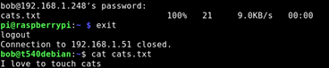

# Copy a file over SSH using SCP

*September 14, 2018*

Scenario: Your file is on one linux machine. You want it somewhere else.

[Video: https://www.youtube.com/watch?v=4GYsAWGP9eM]

You SSH to the machine where the file is at, and run the following scp command (Secure Copy Protocol) to copy it to your local machine.

|  |  |
| --- | --- |
| Use the SCP command | Sudo SCP /home/user/source.file user@destinationip:/home/user/destinationfolder/ |

|  |  |
| --- | --- |
| Example: I have a file on “pi@rasperrypi” | 192.168.1.51 |
| I want the file to go to “bob@t540debian” | | 192.168.1.248 |

|  |  |
| --- | --- |
| File is in the home directory on raspberrypi | /home/pi/textfile.txt |
| Want to copy it to bob’s home on t540debian | /home/bob/ |
| For example, a text file. |

Touch to create, echo “with the data” >> to the file, and cat the cat to concatenate the cats. Meow. /home/pi/cats.txt |

  
| Step 1, From $Bob@t540debian, ssh raspberry as user pi | SSH pi@192.168.1.51 |
| Step 2, From ssh as user $pi@rasperrypi | sudo scp /home/cats.txt bob@192.168.1.248:/home/bob/ |

