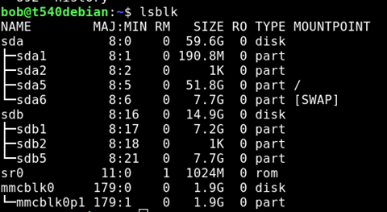

# Dd – writing an img or iso to a disk

*May 4, 2018*

DD (or **D**ata **D**uplicate) is a handy tool for working with disk images. It can also be dangerous if you do not know how it works or get your “if” swapped with your “of” or have the wrong device.

“**If**” is the “source” of the image you are working with, usually an image but it could also be a device.

“**of**” is the “destination” for where you are copying, often to a device or partition.

First, we list the devices and partitions. Then we use DD to write out our file to the destination USB drive.

|  |  |
| --- | --- |
| List the “block” storage devices using **LSBLK** | Lsblk |

My SD card is /**mmcblk0**

|  |  |
| --- | --- |
| Then use [DD](https://www.debian.org/CD/faq/) | dd if=<file> of=<device> bs=4M |
| **Example** 1 – rpi image to SD card | dd bs=4M if=2018-04-18-raspbian-stretch-lite.img of=/dev/mmcblk0 status=progress conv=fsync sync |
| **Example** 2- debian image to usb |

(from /downloads directory) dd bs=4M if=debian-testing-amd64-netinst.iso of=/dev/sdc1 status=progress conv=fsync |

|  |  |
| --- | --- |
| Some of the commands and what they mean | **Status=progress** |

Provides details about the transfer process. It’s nice to know something is happening, especialy with large files and slow storage devices.
|  |  |
| --- | --- |
|  | **bs=4M** |

Bs is block size, so really, bs=BYTES.

You specify the maximum size of the read (if) and write (of) to transfer at a time. By default, this will transfer 512 bytes at a time. Using 4M means 4 Megabytes. Slower drives will simply max out at their peak speed.
|  |  |
| --- | --- |
|  | **;sync** |

finish writing all the things to disk. Important for reasons, such as the amount of data being smaller than the block being written, and it waiting for that block to be filled before writing. Google the reasons.

Also, for other reasons:

**conv=fsync**write the output and meta data before finishing.
| Oh, you may need to run these with sudo | You need full read/ write access. One sure way it ti run as root, so add **sudo** in front to run the command as root. |

You can also reverse this to make an image of a device. You have to be careful of course.

|  |  |
| --- | --- |
| Example. I had just finished settup um my raspbery pi with all the settings as I like them. Wanted to make it easy to “get back” to this point if needed. This command reads from my SD card , mmcblk0, and copies it to the\*.img file, at 8 megabytes per read, providing the status as we go. | **dd if=/dev/mmcblk0 of=/home/bob/Downloads/raspbian-strch-full-JarenBU-12-20-2018.img bs=8M status=progress** |
| Another example is backing up a CD to an \*.iso file, in this case Streets Of Sim City for use on an old windows 98 computer with a broken CD rom drive, so had to copy over via usb drive as an iso. [Clone Sheep](https://www.elby.ch/en/products/vcd.html) to the rescue! | **dd if=/dev/cdrom of /home/bob/Downloads/StreetsOfSimCity.iso** |

|  |
| --- |
| There was some [really good info on reddit](https://www.reddit.com/r/linuxquestions/comments/2hp3mq/what_is_the_purpose_of_the_bs4m_sync_when_using/) regarding byte sizes and sync. |

This is from user “awwtowa”  ||  |

   |
