# Hey Linux, What wireless card do I have?

*February 17, 2018*

I was curious what wireless card I had in my Thinkpad T540p. I have Debian 9 installed on it.  
  
A quick search reveled an [ubuntu forum post](https://ubuntuforums.org/showthread.php?t=1422475) that provided some terminal commands for listing various hardware.

|  |  |
| --- | --- |
| List hardware: | lspci |

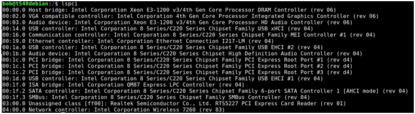

Adding a pipe (|) and grep command with “Wireless” as the filter yields the following

|  |  |
| --- | --- |
| To determine wireless card | lspci | grep Wireless |

Capitalization is important- w vs W

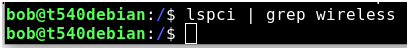

There we go.

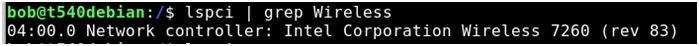

My T540p has an Intel Wireless 7260

Ok, great… but I am curious what else my system has. Specifically, I would like to know some more specifics.

There is a tool called [lshw](https://ezix.org/project/wiki/HardwareLiSter) we can install that will reveal much more information.

|  |  |
| --- | --- |
| List hw | lshw |

Hmm looks like it needs to be installed.

|  |  |
| --- | --- |
| Install lshw | Sudo apt-get install lshw |

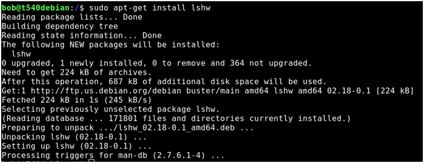

Try it again-

|  |  |
| --- | --- |
| List hardware | lshw |

Wow, information overload. And a note at the end saying I should run this as admin.

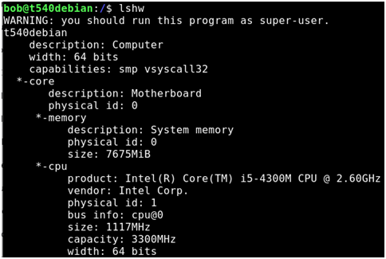

…

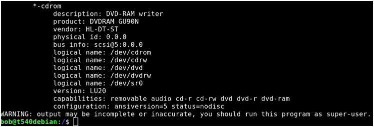

|  |  |
| --- | --- |
| List hardware as root user | Sudo lshw |

Jonny five just called: More Input! More input!

Interesting

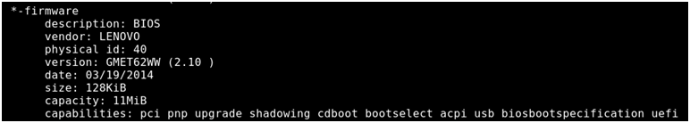

Very interesting

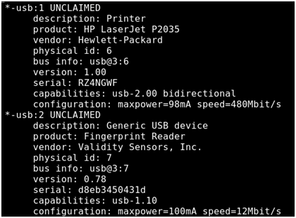

Running a bad command yields a bevy of options, including a “-sanitize” command that removes sensitive information.

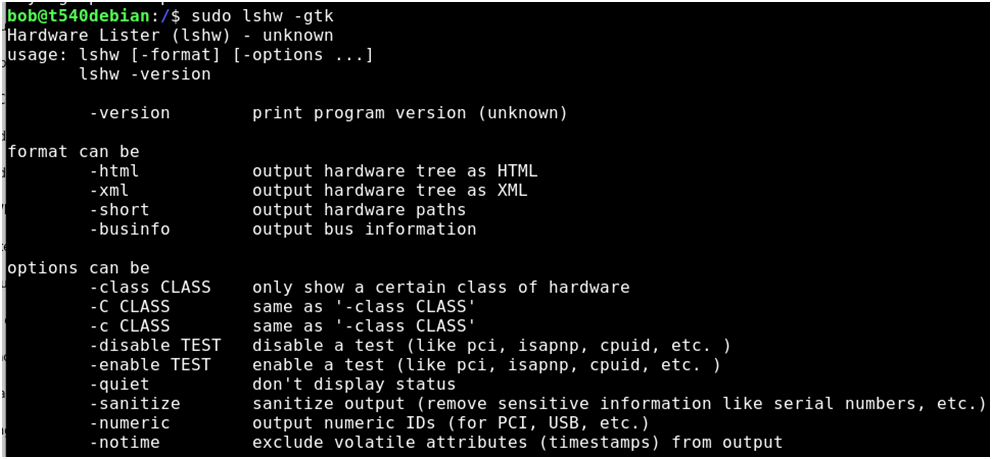

Useful for when posting online.

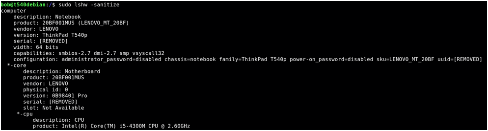

Apparently there is also a graphical version of this. We need to install the package

|  |  |
| --- | --- |
| Install list hardware graphical | Sudo apt-get install lshw-gtk |

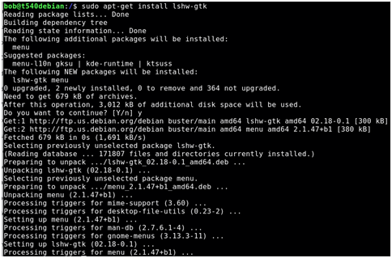

|  |  |
| --- | --- |
| List hardware in graphical mode | lshw-gtk |

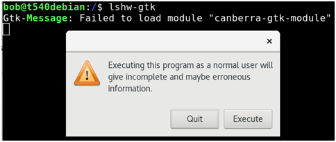

Let’s try it anyway: Execute!

Hmmm

Refresh button

Double click to start exploring

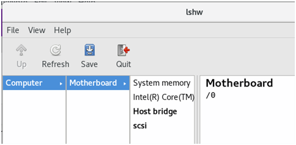

Way more information!

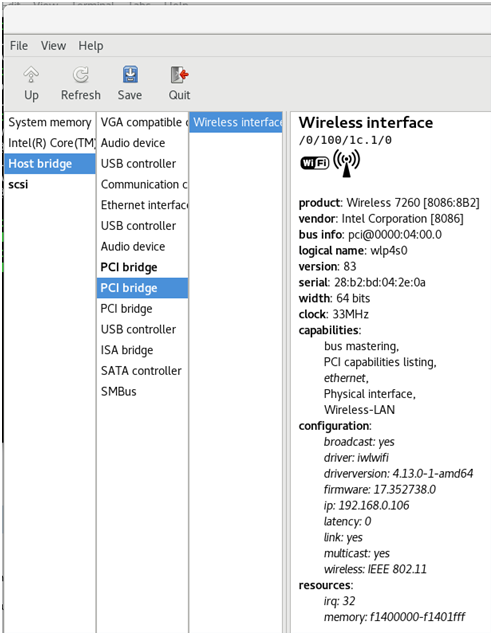
