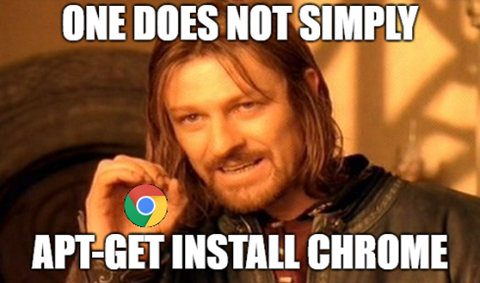

# Install Chrome on Debian

*February 7, 2018*

How to install Google Chrome in Linux (Debian).

One does not simply “download” chrome as on pc or mac.

Nor does one simply apt-get install chrome. It’s always more complicated.

---

The “simple” way, per [allaboutlinux](http://www.allaboutlinux.eu/install-google-chrome-in-debian-8/)

- Go to Google’s chrome download page

  find the linux version “64 bit .deb (For Debian/Ubuntu)”. Download it.

  file name should look something like “google-chrome-stable\_current\_amd64.deb”
- open a terminal go to Downloads directory and try to install the package using “dpkg -i”command.

|  |  |
| --- | --- |
|  | **cd ~/Downloads/** |
|  | **sudo dpkg -i google-chrome-stable\_current\_amd64.deb** |

if you get an errors, you are probably missing dependencies are missing. Fix by apt-get -f install.

|  |  |
| --- | --- |
|  | **sudo apt-get -f install** |

Run the install again

|  |  |
| --- | --- |
|  | **sudo dpkg -i google-chrome-stable\_current\_amd64.deb** |

Run chrome “google-chrome” or click the icon in the menu.

|  |  |
| --- | --- |
|  | **google-chrome** |

---

A [second method](https://www.quora.com/How-can-I-install-Google-Chrome-in-Ubuntu-using-a-command) is to install via apt-get

|  |  |
| --- | --- |
| What it does | What to enter on the CLI |
| add the key | **wget -q -O – <https://dl-ssl.google.com/linux/linux_signing_key.pub> | sudo apt-key add –** |
| set repository | **echo ‘deb [arch=amd64] <http://dl.google.com/linux/chrome/deb/> stable main’ | sudo tee /etc/apt/sources.list.d/google-chrome.list** |
| Update packages | **sudo apt-get update** |
| install | **sudo apt-get install google-chrome-stable** |
| run | **google-chrome** |
