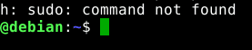

# Install Sudo (on Debian)

*February 4, 2018*

I was surprised that the “sudo” command did not work after installing debian. Fortunatly, it is very easy to install and configure.

Bash: sudo: command not found

|  |  |
| --- | --- |
| How to Enable sudo | <http://milq.github.io/enable-sudo-user-account-debian/> |
| Login as root | su root |
| Apt-Get sudo | Apt-get install sudo |
| Add user | Adduser bob sudo |
| Log out of root, log out of bob, log in as bob, try again | success |
