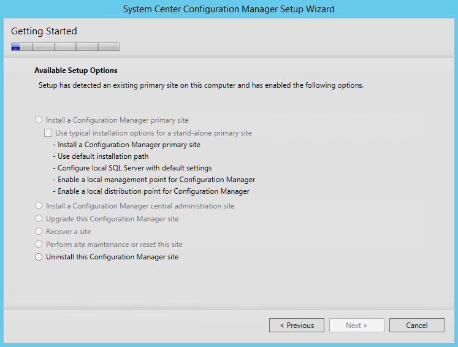
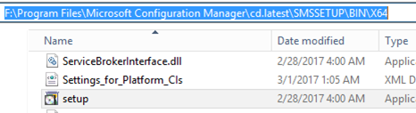
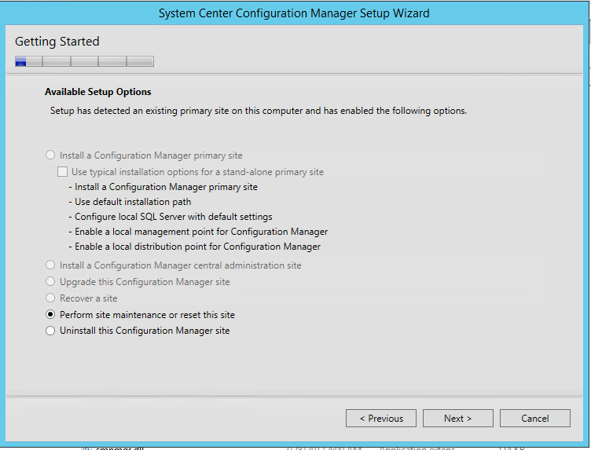
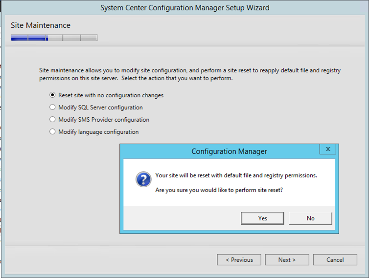
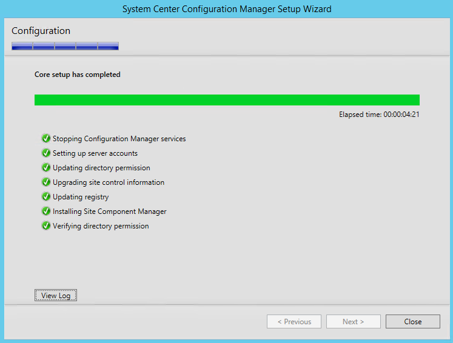
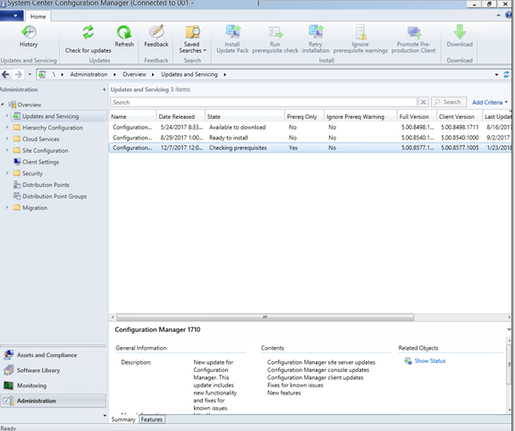

# SCCM Site Reset

*January 23, 2018*

My SCCM upgrade project has been sitting since August 2017. I had wanted to upgrade my SCCM 2012 to the current branch, in order to do a system deployment (200+ convertible laptops on W10 “Creators” 1703). Due to time constraints and seeming endless issues, I ended up going with simple WDS + MDT.

Now that I have had some time to solve most other fires, it is high time to get SCCM back on the rails.

I ran across a tweet linking over to Mikael Nystom’s deployment bunny blog.

|  |
| --- |
| **You need to do a site reset after OS upgrade on your ConfigMgr site server**  Posted by [**Mikael Nystrom**](https://anothermike2.wordpress.com/) on January 11, 2018  Working at a customer, doing an in place upgrade from Windows Server 2008 R2 server with ConfigMgr 1606 to Windows Server 2016.  After the upgrade a connection to the ConfigMgr cannot be made using the console, investigating it and we found out that the Root\SMS namespace has gone, (even running as system it was not to find)  Asking around, no one have seen this, but my friend [**Johan Arwidmark**](https://www.linkedin.com/in/jarwidmark/) sent an email to the product team, and the reply was easy to understand (yet, undocumented)      You do need to do a site reset after an OS upgrade, and after that, it all works like a charm  Here is some guidance to doing such upgrade, just don’t forget to run a site reset.  [**http://ccmexec.com/2016/03/configmgr-cb-1602-server-2008-r2-in-place-upgrade-to-2012-r2/**](http://ccmexec.com/2016/03/configmgr-cb-1602-server-2008-r2-in-place-upgrade-to-2012-r2/)  [**https://technet.microsoft.com/library/hh852345.aspx**](https://technet.microsoft.com/library/hh852345.aspx)    From <<https://deploymentbunny.com/2018/01/11/nice-to-know-you-need-to-do-a-site-reset-after-os-upgrade-on-your-configmgr-site-server/> |

I never ran this step. Could it be that simple?

|  |  |
| --- | --- |
| Ok, how do I do a site reset? | To perform a site reset   1. Run **Configuration Manager Setup** from **<Configuration Manager site installation folder>\BIN\X64\setup.exe**. 2. On the **Getting Started** page, select **Perform site maintenance or reset this site**, and then click **Next**. 3. On the **Site Maintenance** page, select **Reset site with no configuration changes**, and then click **Next**. 4. Click **Yes** to begin the site reset.   When the site reset is finished, click **Close** to complete this procedure.    From <<https://technet.microsoft.com/en-us/library/hh427336.aspx>> |

What installer did I use? Is the mounted cd, or this collection of folders all with different version?

Nope, nope, nope… option not present on those installers.

So, let’s find something more up to date:

|  |  |
| --- | --- |
| Option 1 | use the install media (matching your install) and run setup. |
| \*Option 2 | Find the [**cd.latest** folder](https://docs.microsoft.com/en-us/sccm/core/servers/manage/the-cd.latest-folder) and run setup.exe from the SMSSETUP\BIN\x64 folder.  For me, the location of the cd.latest folder was: |
|  | F:\**Program Files\Microsoft Configuration Manager\cd.latest**\SMSSETUP\BIN\X64 |

Setup came up, and what do you know, There is the “perform site maintenance” option available.

And now we can upgrade from CM1702 to 1710!

