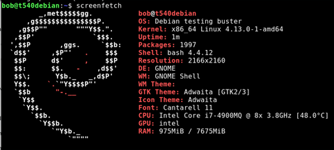
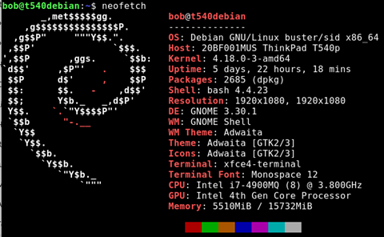

# Screenfetch and Neofetch

*February 22, 2018*

What version of debian am I running? What is my system uptime? What is my current display resolution? what cpu do I have?

All of these questions and more may keep you up at night. This simple trick will help answer your questions so you can get back to sleep.

1. Screenfetch
2. Neofetch

|  |  |
| --- | --- |
|  | Sudo apt-get install **screenfetch** |
|  | Screenfetch |

What is neofetch? Oh, it’s the same, just slightly better.

|  |  |
| --- | --- |
|  | Sudo apt-get install **neofetch** |

Oooo… Fancy.
