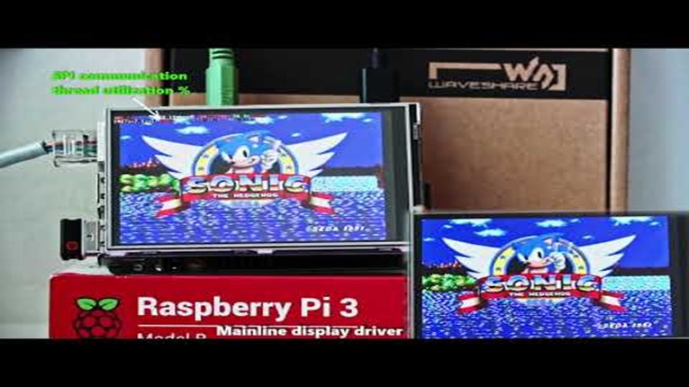
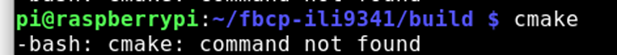
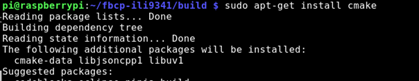
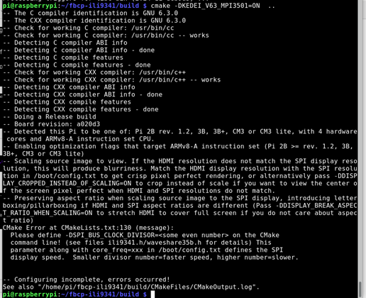
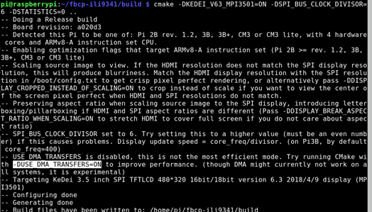
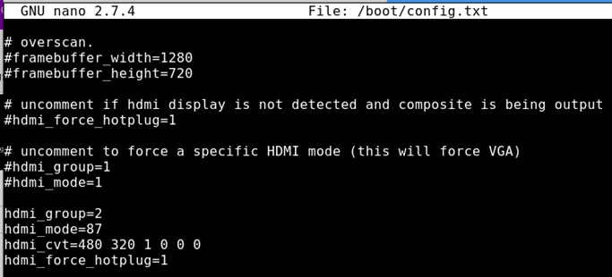

# SPI  fast Display library is good, KEDEI 3.5 is Garbage.

*December 19, 2018*

Video notes for SPI display install on a raspberry pi, “liveblog” style.  
A bit lengthy due to my preferred editing style (none).

 [Part 1](https://youtu.be/fzNl4dB_Vis) is riddled with typos and ends with some frustration.

 [Part 2](https://www.youtube.com/watch?v=FrldurB37QM) is a roller coaster of excitement, but more importantly, many lessons learned.

[Part 3](https://www.youtube.com/channel/UCQbz9BSSJd7PSli9FUbDcQQ/videos?disable_polymer=1) has some feedback from the author of the library, squirrels, I do some singing, and a conclusion.

Please see my videos for context, but basically the Kedei display is garbage, buy an adafruit or waveshare.

The linked [library](https://github.com/juj/fbcp-ili9341) by juj is AMAZING,  and when used with those waveshare or adafruit spi displays, you can achieve very fast frame rates.

|  |  |
| --- | --- |
| Pinouts |  |
| Pi stacked |  |

|  |  |
| --- | --- |
| SPI display |  |
| “Juj”‘s Example video | [fbcp-ili9341 ported to ILI9486 WaveShare 3.5″ (B) SpotPear 320×480 SPI display](https://www.youtube.com/watch?v=dqOLIHOjLq4) |

  

|  |  |
| --- | --- |
| Library | <https://github.com/juj/fbcp-ili9341> |
| Instructions | Use raspi-config to configure raspbery pi |

- Enable ssh

Find out ip address ussing “ip address”

Ssh to the rpi
|  |  |
| --- | --- |
| Ssh pi@192.168.1.51 |  |
| Assuming stock, no changes to /boot/config.txt |

If needed, would need to disable dtoverlay or dtparam lines with the #  || Cat /boot/config.txt | Scroll down…  Looks good |
| Build and run: |

git clone <https://github.com/juj/fbcp-ili9341.git>

cd fbcp-ili9341

mkdir build

cd build

cmake [options] ..

make -j

sudo ./fbcp-ili9341 \*Replace [options] with the appropriate display type. |

Make sure you have cmake!

If not

**Sudo apt-get install cmake**

Then run again

cmake -DKEDEI\_V63\_MPI3501=ON ..

Errors!

Missing display speed

-DSPI\_BUS\_CLOCK\_DIVISOR=6

So

cmake -DKEDEI\_V63\_MPI3501=ON -DSPI\_BUS\_CLOCK\_DIVISOR=6 -DSTATISTICS=0 ..

 

|  | Possibly add -DUSE\_DMA\_TRANSFERS=ON   cmake -DKEDEI\_V63\_MPI3501=ON -DSPI\_BUS\_CLOCK\_DIVISOR=6 -DSTATISTICS=0 -DUSE\_DMA\_TRANSFERS=ON ..  Result: no change to white screen  cmake -DKEDEI\_V63\_MPI3501=ON -DSPI\_BUS\_CLOCK\_DIVISOR=30 .. |
| Make -j |  |
| Run it | No dice? |
| Auto load on statups | sudo /home/pi/fbcp-ili9341/build/fbcp-ili9341 & |
| Some notes on rc.local <https://www.raspberrypi.org/documentation/linux/usage/rc-local.md>  Use & to split  Use full path naems not relative | Edit /etc/rc.local and add |

sudo nano /etc/rc.local

sudo /home/pi/fbcp-ili9341/build/fbcp-ili9341 &

And that should go before the exit 0

As so

 

Edit the hdmi size settings in

boot/config.txt

Don’t forget the refresh rate!

Using

Sudo nano /boot/config.txt

Notes on config.txt

Rpf.io/config

Notes on custom HDMI\_MODE=87  
<https://www.raspberrypi.org/forums/viewtopic.php?f=29&t=24679>

  
hdmi\_group=2  
hdmi\_mode=87  
hdmi\_cvt=480 320 60 1 0 0 0  
hdmi\_force\_hotplug=1

 Could this be helpful?”What I generally do to debug is connect to the Pi via SSH and run watch -n 0.1 gpio -g readallto observe what the IN/OUT and HIGH/LOW status of each GPIO register is, and cross reference the schematics of the display to see if the reset line is as needed.” – <https://github.com/juj/fbcp-ili9341/issues/3>Conclusion”The KeDei v6.3 display with MPI3501 controller takes the crown of being horrible.”

|  |  |  |  |
| --- | --- | --- | --- |
| Can we try the alt git tree? No, not for this one.  Details  <https://stackoverflow.com/questions/7832770/how-to-get-certain-commit-from-github-project/33345534> | <https://github.com/juj/fbcp-ili9341/commit/4c9229037e923e8f1b866afbcb79b556bf808c4f> |  |  | | --- | --- | |  | Cd (repo) Git checkout #### | |
| Command to try other tree. | Git checkout 4c9229037e923e8f1b866afbcb79b556bf808c4f |
| Result: | Would not compile. |
