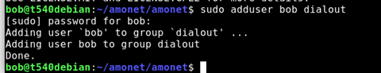
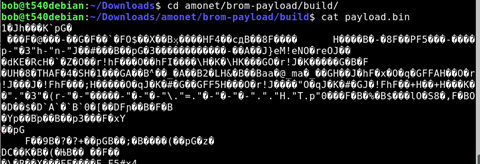
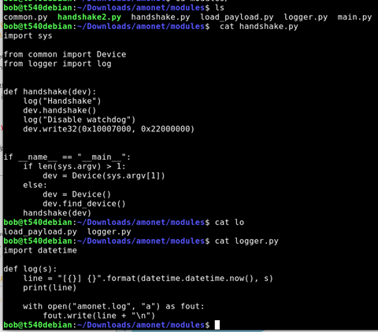
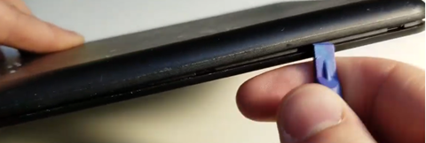
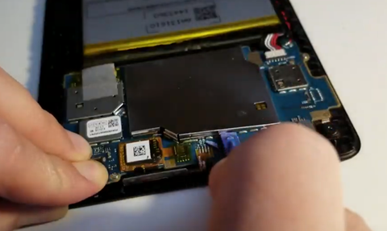
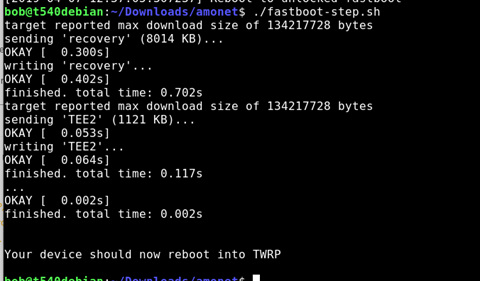
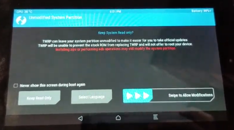
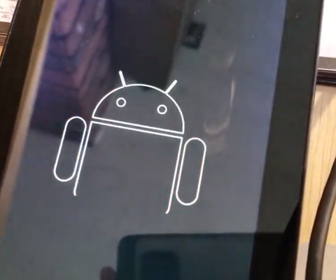
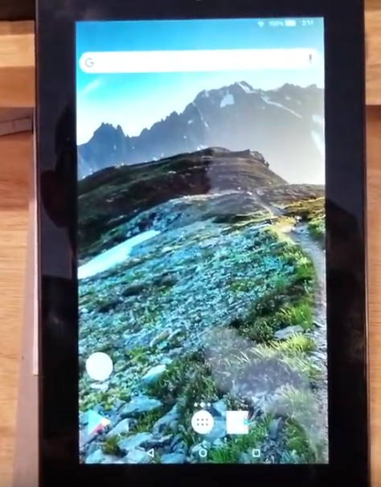
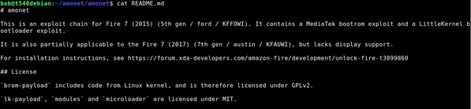

# Unlock and Root: Loading a custom ROM on Kindle Fire 7 (5th gen)

*April 9, 2019*

I bought a $35 kindle fire 7 a few years ago. 2019 is the year to “root it” and make it mine.

[Loading a custom rom on a Kindle fire 7 (5th gen) in 2019](https://www.youtube.com/watch?v=VecO6svCQgc)

[Video: https://www.youtube.com/watch?v=VecO6svCQgc]

  
Lately, my kindle has been acting slow, freezing, disconnecting from wifi, and generally being a party pooper, plus all of the “offers”. I just want to watch Star Trek /Star Gate while I am cooking dinner. 2019 is the year to make it mine and to kick forced offers and updates to the curb.

This video shows my process for unlocking a kindle fire 7 (5th gen), using an exploit called Amonet that works on MediaTek processors. This exploit package allows you to boot a custom recovery tool ( [TWRP](https://www.google.com/search?q=what+is+twrp) ) which lets you flash a custom rom or tools to access root.

I am doing this process per instructions from [k4y0z](https://forum.xda-developers.com/member.php?s=5169b0cf70d6096a5a936f9bc9dd0ab2&u=7104332) on XDA. (Many thanks to all for your hard work! )  
original post on XDA: <https://forum.xda-developers.com/amazon-fire/development/unlock-fire-t3899860>

To do this, you need:

- a computer running linux

  - I use Debian in this example, but you could use a [live usb disk](https://tutorials.ubuntu.com/tutorial/tutorial-create-a-usb-stick-on-windows).
- Small plastic tools to open your kindle
- Tweezers or paperclip will work fine for shorting the pin to ground
- Patience and attention to detail.
- SD Card and way of copying files to sd card from computer
- Current version of the [amonet](https://github.com/xyzz/amonet) exploit tool for mediatek processors for the kindle fire 7.
- A custom rom, optional root installer

high level process

1. prepare computer environment and run the script
2. short the pin while plugging in kindle, follow prompts to run next script
3. use TRWP to load a custom rom.

My notes:

|  |  |
| --- | --- |
| Read the whole thing before proceeding:  <https://www.xda-developers.com/amazon-fire-7-5th-7th-gen-unlocked-rooted/>  You will need to add “sudo” before all commands. | apt update   add-apt-repository universe   apt install python3 python3-serial android-tools-adb android-tools-fastboot |
| Stop modem manager if necessary | **systemctl stop ModemManager**  Also, Disable |
| adduser to the dialout group | Sudo adduser bob dialout |

  
| My current OS | I have 5.3.3  (if you have 5.3.2 or prior, you do not need to open your device. With device off, you can simply hold the left volume button and then plug in to usb)  If you have 5.3.3 or higher, continue reading |
| On the kinlde:  Back up your device | If you have anything on your device, back it up.   Also, there is a chance you could do something wrong and turn your tablet into a paperweight, so please proceed knowing that this could be the last time your kindle turns on. Proceed at your own risk. |
| Unzip the amonet exploit files and navigate to the folder | Cd Downloads  Unzip amonet-force bla.zip  cd amonet |
| You should Always look at things from the internet before you run them. | Cat bootrom-step.sh      Cat /modules/main.py |

ls

Cat payload.py

l

Alright… looks like it does android things.

🙂
| Turn off kindle.  Open the device | Insert your plastic pry tool into the side. I had to fiddle with it. I started just to the right of the SD card and pressed in. I slipped and smacked my hand on the desk. Ow. |

  
| Pop off the metal cover over the chips | I had to use a stronger tool as my plastic tool was not strong enough , and it was quite firmly secured. You need to be careful not to pry against any components, they are tiny and could break. Go slow, and be careful. |

  
| Get your computer ready. |  |
| You will short the pin in the middle to ground. The metal frame is ground.  You do not need to see the screen, just hold the tweezers or wire while you plug in the USB. | You only need to hold this for a few seconds. |
| Turn off, be ready to plug USB into computer. |  |
|  |  |
| Here goes..  Use sudo  Start by Running this code>  Then,  With device off, while |

Holding the tweezers or paperclip in place “shorting” to ground, plug in the USB cord to the computer.

  ./bootrom-step.py || You can take the tweezers off now. |

Follow the instructions- Click the enter button. For me, that means removing the cover that is pressing the button. || It should go through a few things, loading…  Wait for the things | It reboots |
| At the screen, run the next command for fast boot.  ./fastbook-step.sh | ./fastboot-step.sh |

And it reboots into TWRP

Slide right

Woot! Now you can load a custom rom or root the device with magisk.
|  |  |
| --- | --- |
| From TWRP | per instructions, you can Use TWRP to flash custom ROM, Magisk or SuperSU.For custom roms, I was only aware of the one mentioned in the article specifically for the kindle fire 7.FireOS Revamped  https://forum.xda-developers.com/amazon-fire/development/rom-fire-os-revamped-t3899921/post78900188#post78900188 |
| flash your rom | In my [video](https://youtu.be/VecO6svCQgc), I backed up my device to an SD card using the backup function. Then I wiped my device. Then I accidentally did a full restore to factory, and did not click the right zip file and installed magisk by accident. |

Then I flashed the rom and it worked.

You know it is working when you see the android animation at boot.

If you don’t see the android, you did something wrong, like me 🙂

|  |  |
| --- | --- |
| Result? | A working kindle fire 7 with no offers or junk installed, and no forced over the air updates. |

  
| Enjoy! |  |

|  |  |
| --- | --- |
| **Troubleshooting**: |  |
| If you see this kind of error, make sure you run as sudo, or you add your user name to the dialout group.  You can also try a different USB port. |  |
| Is it plugged in? | Plug in kindle, turn on, enable adb, and use **lsusb** to see that it is connected. |

You can also run **dmesg** to see if it shows up.
| SUDO   ./bootrom-step.py | No connection? Try a different USB port? |
|  | Read the instructions |

<https://forum.xda-developers.com/amazon-fire/development/unlock-fire-t3899860>
