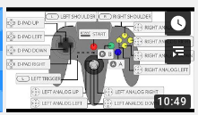

# Installing Retropi and Pi Hole, using a Linux computer

*December 29, 2019*

In this video, I explain how to get a raspberry pie 3 to pull double dute as an entertainment device as well as some added utility by having is run both retropie for gaming and pihole for advertisement filtering. Oh -and we are doing this all from a linux (Debian 10 ) basedclr

computer.

|  |  |
| --- | --- |
| Things you need | - Raspberry Pi, version 2b or 3b recommended - Sd card, recommended 8G or larger, Class 10 or faster. - Cords and connectors to connect to power, audio, video and network - USB keyboard. Mouse optional. - USB Game controller (snes, n64 or similar) - Method of plugging microSD card into a computer (SD card adapter or similar) |
| Things you need to know | 99% of “Roms” obtained online are straight up illegal copies of Nintendos intellectual property. Do not download roms. Read more [about that here](https://arstechnica.com/gaming/2018/08/can-a-digital-lending-library-solve-classic-gamings-piracy-problem/) |
| Things to download | Retro Pi  [https://retropie.org.uk/download/#Pre-made\_images\_for\_the\_Raspberry\_Pi](https://retropie.org.uk/download/) |
| Process | 1. Extract the retropi.img.tar.gz file. You can’t flash a tar.gz file! 2. Flash new RetroPi.img image to SD card using DD 3. Boot up raspberry pi. If all goes well, you will be greeted with the rainbow, then the installer. 4. Complete installation by setting up a game controller. I used [this video tutorial](https://www.youtube.com/watch?v=pl4meht_86w) from [Linux4UnMe](https://www.youtube.com/channel/UC7-BWdwziR8LozMCBD1Ei7w) for an N64 controller and it had some great hints 5. Enable SSH (under Raspiconfig, Interface Options, SSH) 6. Using an SFTP file transfer program, copy over some legitimate, open source games 7. Find IP Address and connect via SSH 8. Run the pi hole curl / script 9. change your DNS settings on your pc or router and test it out! 10. play video games |
| Setup N64 Game controller hints | <https://www.youtube.com/watch?v=pl4meht_86w> |

  
|  |  |
|  |  |
|  |  |
| Commands for later | lsblk |

dd

[how to use DD](http://jarenhavell.com/2018/05/04/dd-writing-an-img-or-iso-to-a-disk/) and LSBLK

|  |  |
| --- | --- |
| Install FileZilla | Sudo apt-get install filezilla |

or find in the app store
|  |  |
| --- | --- |
| Upload roms to raspberry pi | connect using IP address  User: Pi  Pass: raspberry  port: 22 |

Path:

/home/pi/RetroPie/roms/

you may need to restart retropi to see that directory.
|  |  |
| --- | --- |
| SSH into Pi | Ssh pi@192.168.1.51 |
| Install PiHole | You can [read about more ways](https://docs.pi-hole.net/main/basic-install/) to install pihole, but it is literally as simple as running this: |

curl -sSL <https://install.pi-hole.net> | bash

 
| PieHole add on | Add on for [Firefox](https://www.reddit.com/r/pihole/comments/8zrj3y/pihole_addon_for_firefox/) and [Chrome](https://www.reddit.com/r/pihole/comments/9183ix/pihole_extension_for_chrome/) to easily disable pihole for a few minutes.  <https://github.com/Spencer-Yoder/Remote-Switch-for-Pi-Hole-Chrome> |
|  |  |
|  |  |
|  |  |

Parking Lot Ideas

|  |  |
| --- | --- |
| *Further Reading / Research:  Homebrew Games on Nintendo 64?* | Writing Your own N64 games? |

<https://www.neoflash.com/forum/index.php?topic=7444.0>

And more details  
h<https://n64squid.com/homebrew/>
| *Ever deeper down the nintendo pie-hole: A Rom Patch for nintendo games? Mods Hacks?* | If you own a legal game (like, a physical cartridge) and a game genie cartridge (more hardware) , you can play with some fun IPS patches like this [CYBERTRUCK patch](http://n64vault.com/ge-for-fun:cybertruck) for Golden Eye 007. ([video](https://www.youtube.com/watch?v=wQ3tnsMlkBI)) |
| *Legal Roms* | NES |

[Open source Original SNES/NES games at RomHacking](http://www.romhacking.net/homebrew/)

Or at [NESWORLD](http://www.nesworld.com/article.php?system=nes&data=neshomebrew)

Try out [2048](http://www.romhacking.net/homebrew/65/) or [BlockDude](http://www.romhacking.net/homebrew/104/)(Ti-83 port) or BladeBuster

SNES

Try out [ChristmasCraze](http://www.romhacking.net/homebrew/89/) or [BladeBuster](http://www.nesworld.com/article.php?system=nes&data=neshomebrew)

N64  
[Open Source Original n64 games at n64Squid](https://n64squid.com/homebrew/)

Try out [Pyoro 64](https://n64squid.com/pyoro-64/) or [Dexanoid](https://n64squid.com/dexanoid/)
